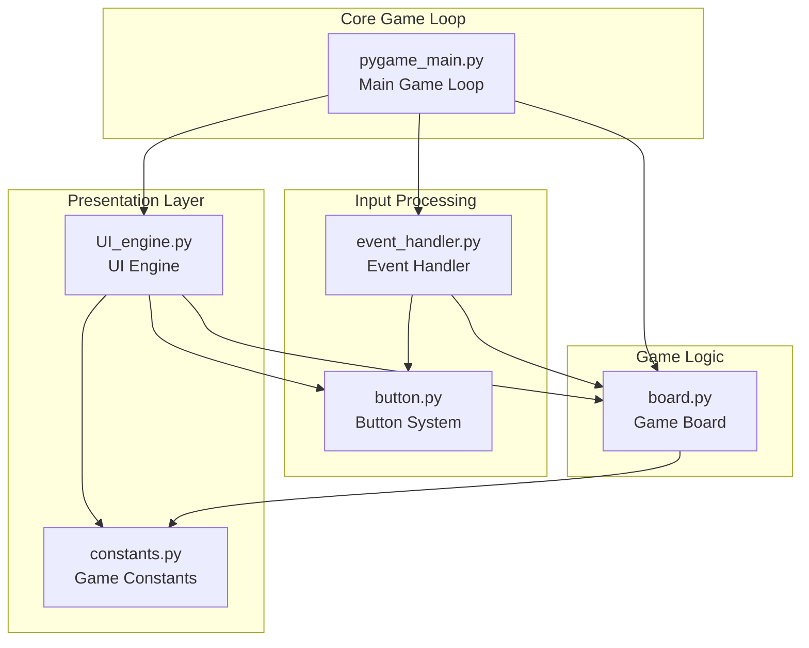
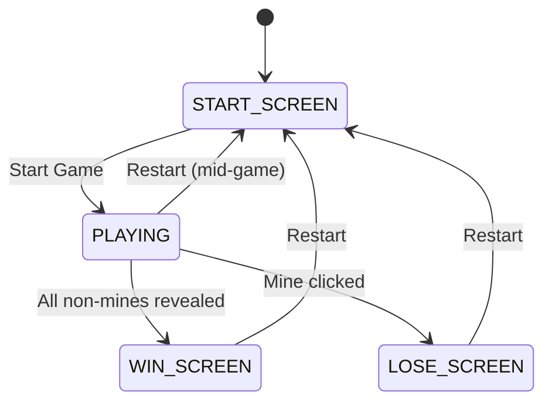

# Minesweeper System Architecture

## Table of Contents
- [System Overview](#system-overview)
- [Architecture Diagram](#architecture-diagram)
- [Core Components](#core-components)
- [Game States](#game-states)
- [Key Data Structures](#key-data-structures)

## System Overview

This Minesweeper implementation follows a modular, event-driven architecture built with Pygame. The system separates concerns between game logic, user interface, event handling, and state management, making it highly extensible and maintainable.

### Technology Stack
- **Python 3.x** - Core language
- **Pygame** - Graphics and input handling

## Architecture Diagram



## Core Components

### 1. Main Game Loop (`pygame_main.py`)
**Responsibility**: Application entry point and main game loop management

- Initializes Pygame and display surface
- Sets up UI components and game objects
- Runs the main game loop at 60 FPS
- Coordinates between event handling and display updates

**Key Functions**:
- `main()` - Entry point and game loop

### 2. Event Handler (`event_handler.py`)
**Responsibility**: Processes all user input and translates to game actions

- Handles mouse clicks (left/right button)
- Processes button interactions
- Manages game cell interactions
- Handles application quit events

**Interface**:
```python
class EventHandler:
    @staticmethod
    def HandleEvent(event: pygame.event, game: Board) -> None:
        """Process single pygame event and dispatch appropriate actions"""
```

**Event Types Processed**:
- `MOUSEBUTTONDOWN` - Left/right mouse clicks
- `QUIT` - Application close events

**Mouse Event Processing**:
```python
# Left Click Processing
if leftMousePressed:
    # Button collision detection
    for button in ButtonClass.ButtonList:
        if button.mRect.collidepoint(position):
            # Button-specific action dispatch
            
    # Game cell interaction (during PLAYING state)
    if game.state == GameState.PLAYING:
        x, y = pygame.mouse.get_pos()
        r, c = y // CELL_SIZE, x // CELL_SIZE
        game.RevealSpace((r, c))

# Right Click Processing  
if rightMousePressed and game.state == GameState.PLAYING:
    # Flag placement/removal
    game.PlaceFlag((r, c))
```

### 3. UI Engine (`ui_engine.py`)
**Responsibility**: Renders all visual elements and manages display states

- Renders different game screens (start, playing, win, lose)
- Handles button display and visual feedback
- Manages game board rendering
- Provides explosion animations and visual effects
- Manages particle systems for enhanced user experience

**Key Functions**:
- `UpdateDisplay(surface, board, time)` - Main display update
- `DisplayStartScreen()` - Start screen rendering
- `DisplayPlayingScreen()` - Game board and UI rendering
- `DisplayWinScreen()` / `DisplayLoseScreen()` - End game screens
- `InitializeButtonList()` - Button setup

### 4. Game Board (`board.py`)
**Responsibility**: Core game logic and state management

- Manages game state transitions
- Handles board generation and mine placement
- Processes game moves (reveal, flag)
- Implements win/lose condition checking
- Manages timing functionality

**Key Functions**:
- `GenerateBoard(startIdx)` - Creates minefield avoiding first click
- `RevealSpace(spaceIdx)` - Processes cell reveals with flood fill
- `PlaceFlag(spaceIdx)` - Flag/unflag functionality
- `CheckWin()` - Win condition validation

### 5. Button System (`button.py`)
**Purpose**: Button definition, management, and interaction handling

**Key Responsibilities**:
- Button type enumeration
- Button data structure definition
- Global button registry management
- State-based button visibility

**Interface**:
```python
class ButtonTypes(Enum):
    MINE_SELECT_UP_ARROW = 0
    MINE_SELECT_DOWN_ARROW = 1
    MINE_SELECT_START = 2
    MIDGAME_RESTART_GAME = 3
    WIN_RESTART_GAME = 4
    LOSE_RESTART_GAME = 5

class ButtonInfo:
    def __init__(self, aButtonType, aImg, aCenter, aOnState)
    
ButtonList: list[ButtonInfo]  # Global button registry
```

**Button State Management**:
Each button has an associated `GameState` that determines when it's visible and clickable:
- Start screen buttons: Only active during `START_SCREEN`
- Game restart buttons: State-specific (playing, win, lose)

**Button Creation Process**:
1. Load/create button sprite
2. Define position and collision area
3. Associate with appropriate game state
4. Add to global `ButtonList`

### 6. Constants (`constants.py`)
**Responsibility**: Centralized configuration and asset management

- Color definitions
- Screen dimensions and game parameters
- Sprite loading and scaling
- Game configuration constants

## Game States

The system uses a finite state machine with four main states:



## Key Data Structures

### BoardPiece Enum
```python
class BoardPiece(Enum):
    MINE = 'M'
    FLAG = 'F' 
    UNKNOWN = 'U'
    ZERO = 0
    ONE = 1
    # ... through EIGHT = 8
```

### Board Class Core Data
```python
class Board:
    board_size: int = 10                    # Grid dimensions
    mines: int                              # Mine count
    flags: int                              # Available flags
    state: GameState                        # Current game state
    visible_board: list[list[BoardPiece]]   # Player-visible state
    actual_board: list[list[BoardPiece]]    # True board state
    board_generated: bool                   # First move flag
    StartTime: int                          # Game timing
```

### Button System
```python
class ButtonInfo:
    mButtonType: ButtonTypes    # Button function
    mImg: pygame.Surface        # Button sprite
    mRect: pygame.Rect          # Collision area
    mOnState: GameState         # When to display
```

### Project Structure
```
minesweeper/
├── pygame_main.py          # Entry point
├── board.py               # Game logic
├── event_handler.py       # Input processing  
├── UI_engine.py          # Display rendering
├── button.py             # UI interactions
├── constants.py          # Configuration
├── sprites/              # Game assets
│   ├── start_screen/
│   └── [game sprites]
└── fonts/               # Typography assets
```

### Dependencies
```bash
pip install pygame
```

This architecture provides a solid foundation that can be extended for additional features like different difficulty levels, custom board sizes,enhanced visual effects while maintaining clean separation of concerns.