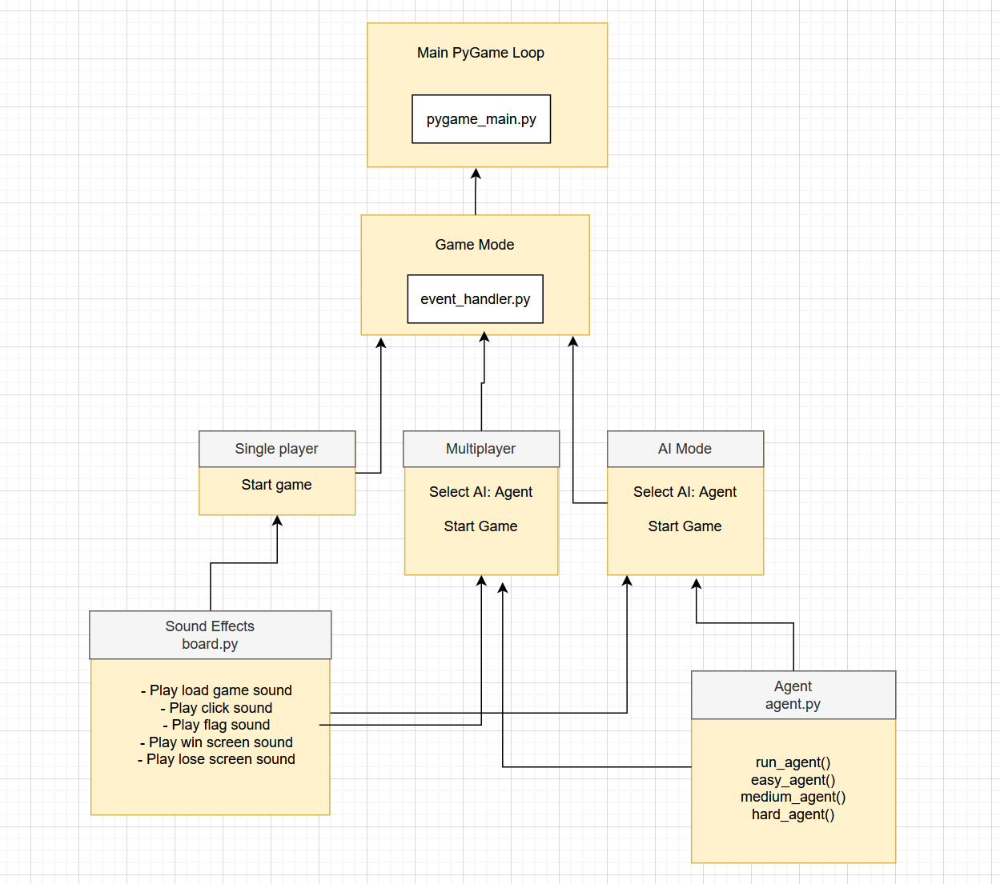
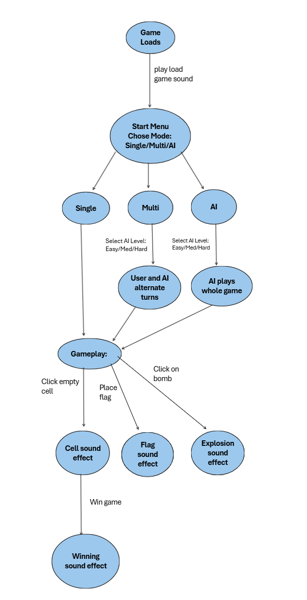

# Minesweeper Part 2 System Architecture

## System Overview
Our implementation of sound effects, multiplayer, and AI mode follow the previous teams implementation of a modular, event-driven architecture using Pygame. We added an agents.py file which is where the functions for easy, medium, and hard AI are written. The sound effects that we integrated are in board.py which is where all of the actions that cause a sound effect to play are.

## Architecture Diagram

## Core Components
### 1. agent.py
**Responsibility**: Run easy, medium, or hard AI
- Takes in the selection from the user of which AI they want and runs the function corresponding to it

**Key Functions**: 
- run_agent() - runs one of the following depending on the users selection
    - easy_agent()
    - medium_agent()
    - hard_agent()

### 2. board.py
**Responsibility**: Play the sound effects when activated
- When specific actions are done in the game the corresponding sound will play

### 3. UI_engine.py
**Responsibilty**: Handles drawing and animating the AI agent character
- When the user is playing in multiplayer or AI mode, the AI character will show the user its moves

## Data Flow

## Key Data Structures ???